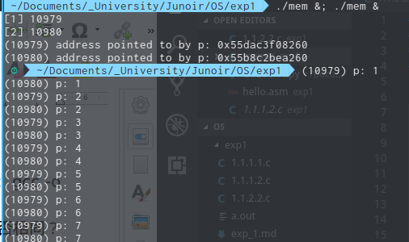

## 16281038 韩坤洋

## 一、（系统调用实验）
### 1.1、参考下列网址中的程序。阅读分别运行用API接口函数getpid()直接调用和汇编中断调用两种方式调用Linux操作系统的同一个系统调用getpid的程序(请问getpid的系统调用号是多少？linux系统调用的中断向量号是多少？)。
如图所示，分别为 5144 5317


getpid的系统调用号是0x14，linux系统中中断向量号是0x80
### 1.2、上机完成习题1.13。

``` assembly
global    _start

section   .text
_start:   
    mov       rax, 1                  
    mov       rdi, 1                  
    mov       rsi, message            
    mov       rdx, 13                 
    int 0x80                           
    mov       rax, 60                  
    xor       rdi, rdi                
    int 0x80                          

section   .data
    message:  db        "Hello, World", 10
```

``` c
#include <stdio.h>
#include <unistd.h>

int main(){
    printf("Hello, World\n");

    return 0;
}
```
运行结果如下


### 1.3、阅读pintos操作系统源代码，画出系统调用实现的流程图。

.png)

## 二、（并发实验）根据以下代码完成下面的实验。
### 1、 编译运行该程序（cpu.c），观察输出结果，说明程序功能。

直接运行（./cpu）会因为缺少参数而经由exit(1)直接退出。  
该程序功能就是将调用时传入的参数不断的输出到控制台上。

### 2、再次按下面的运行并观察结果：执行命令：./cpu A & ; ./cpu B & ; ./cpu C & ; ./cpu D &程序cpu运行了几次？他们运行的顺序有何特点和规律？请结合操作系统的特征进行解释。


一共运行了4次，有大致的运行顺序但是不固定，如上图会出现由ABCD变为BACD的顺序。因为操作系统是多道的，给每个程序的时间片结束或是有IO时会切换程序，因此程序运行的顺序并不是固定的。

## 三、（内存分配实验）根据以下代码完成实验。
### 1、 阅读并编译运行该程序(mem.c)，观察输出结果，说明程序功能。(命令： gcc -o mem mem.c –Wall)


一直输出mem进程的进程号以及p的值，从而可以判断在第n秒该进程对应的由操作系统分配的puid。就目前的观察来看该进程的puid没有发生过变化。

### 2、再次按下面的命令运行并观察结果。两个分别运行的程序分配的内存地址是否相同？是否共享同一块物理内存区域？为什么？命令：./mem &; ./mem &



两个程序分配的puid是不一样的，也并不共享同一块物理内存区域。因为从操作系统的角度，虽然这两个程序执行的是相同的操作，但是仍然是两个程序，不能访问对方的内存否则有风险。

## 四、（共享的问题）根据以下代码完成实验。
### 1、 阅读并编译运行该程序，观察输出结果，说明程序功能。（编译命令：gcc -o thread thread.c -Wall –pthread）（执行命令1：./thread 1000）


程序首先接受一个整数参数n，然后创建两个线程同时执行循环n次同时将全局变量自增1。最后输出全局变量的值。

### 2、 尝试其他输入参数并执行，并总结执行结果的有何规律？你能尝试解释它吗？（例如执行命令2：./thread 100000）（或者其他参数。）

对于给定的传入参数n，对最终输出结果m一定有$m \le 2n$。对于这个程序，每个线程都对全局计数变量执行n次自增操作，所以正常逻辑来看计数应当为2n，但是结果却有不少小于2n的情况出现。


对线程的循环次数进行统计，发现并不是有线程提前结束了循环导致了计数的减少。所以推测是多线程程序同时对同一个变量进行修改时，有部分信息发生了丢失。

### 3、 提示：哪些变量是各个线程共享的，线程并发执行时访问共享变量会不会导致意想不到的问题。

此例中，全局变量counter是线程共享的。  
会，线程的并发执行中如果存在对共享向量的同时读写会出现安全性问题，可能导致值的错误。

## 遇到的问题

除去已布置问题外，环境问题主要发生在原文档中提供的代码的不完整导致的gcc编译错误，通过报错很容易找到问题源头。